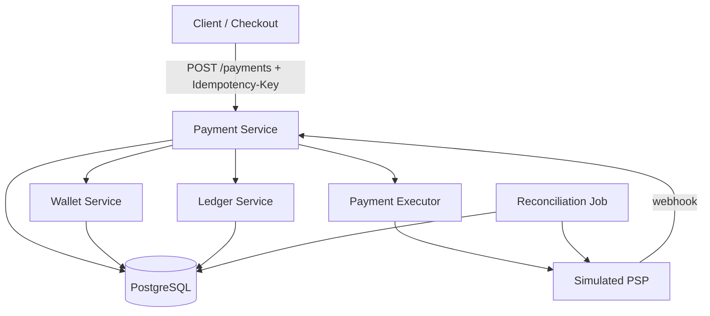

# PayFlow — Project Framing

> **PayFlow** is a self-learning project: a mini payment platform built slice-by-slice to practice **Technical Product Ownership**, **solution design**, and **backend development** in payments.
>
> **Reference architecture:** [Designing a Payment System](../docs/designing-payment-system/designing-a-payment-system.md) (Alex Xu & Sahn Lam, via [Pragmatic Engineer](https://newsletter.pragmaticengineer.com/p/designing-a-payment-system))
>
> **Execution sequence:** [payflow-execution-plan.md](../docs/designing-payment-system/payflow-execution-plan.md)  
> **Epic backlog:** [EPIC-BREAKDOWN.md](./docs/EPIC-BREAKDOWN.md)

---

## 1. Problem Statement

Payment systems look like CRUD APIs until you ask three questions:

1. What happens if the user taps **Pay** twice?
2. What happens if the PSP confirms the charge but **your database write fails**?
3. How do you know your **books are correct** at end of day?

PayFlow exists to answer those questions in code — not just in diagrams. It is a **learning sandbox**, not a production payment processor. The goal is to internalize how money-movement systems enforce **idempotency**, **async state**, **ledger integrity**, and **reconciliation**.

---

## 2. Vision

Build a **credible mini payment backend** that mirrors the architecture from the Xu payment chapter:

- **Payment service** — orchestrates checkout events and coordinates downstream work
- **Payment executor** — executes individual payment orders against a simulated PSP
- **Wallet** — tracks seller balances (operational view)
- **Ledger** — append-only double-entry audit trail (source of truth)
- **Simulated PSP** — stand-in for Stripe/PayPal; async webhooks included in later slices

By the end, you can **demo**, **explain**, and **write PO artifacts** for a payment flow the way a Technical PO in payments would — with enough engineering depth to partner credibly with architects and backend teams.

---

## 3. Who This Is For (Learning Persona)

| Persona | Role in PayFlow |
|---|---|
| **You (builder)** | Technical PO + solution designer + developer |
| **Buyer** | End customer checking out on a marketplace (simulated API client) |
| **Merchant / seller** | Receives pay-out balance in wallet after successful pay-in |
| **Ops / finance** | Runs reconciliation, investigates mismatches (simulated reports) |
| **PSP** | External provider; PayFlow never stores raw card data |

---

## 4. Scope

### In scope (MVP → depth)

| Phase | Capability |
|---|---|
| **MVP (Slices 1–3)** | Idempotent `POST /payments`, lifecycle state machine, auth / capture / void |
| **Core depth (Slices 4–6)** | Double-entry ledger, simulated PSP + webhooks, reconciliation job |
| **Optional polish (Slices 7–8)** | Retry/DLQ patterns, thin checkout UI mapping to async states |

### Out of scope (explicitly)

- Real card processing or PCI-scoped card storage
- Production fraud / AML engines
- Cross-border FX, SWIFT, or bank rails
- Multi-tenant merchant onboarding at scale
- Regulatory certification or audit-ready compliance

**PCI rule for PayFlow:** All card data stays on the **simulated PSP**. PayFlow only stores tokens / references — same pattern as hosted checkout in the reference chapter.

---

## 5. Success Criteria

### Engineering correctness

| Criterion | How you'll prove it |
|---|---|
| No duplicate charges on retry | Same `Idempotency-Key` → same response, one payment record |
| Valid state transitions only | Invalid transitions return `422` with clear errors |
| Ledger always balances | Sum(debits) = sum(credits) for every journal |
| Webhooks are idempotent | Duplicate PSP events don't double-apply |
| Reconciliation catches drift | Simulated settlement file vs internal records → discrepancy report |

### Technical PO / portfolio

| Criterion | How you'll prove it |
|---|---|
| Explain pay-in flow in 3 minutes | Diagram + verbal walkthrough |
| Answer "double-tap Pay" | Idempotency key + stored response |
| User-visible async UX | Status polling / messages per state |
| One PO note per slice | Problem → constraints → decision → metrics |

### Personal career goal

Connect **platform TPO experience** (shell / miniapp / SDK) to **payments domain**:

> A payment miniapp in a shell calls `POST /payments`, polls status, and maps backend states (`AUTHORIZED`, `SETTLED`, `FAILED`) to user copy and retry actions.

---

## 6. Reference Architecture (Target State)

High-level component map aligned to the Xu chapter:



### Pay-in flow (happy path — simplified)

1. Buyer submits checkout → **payment event** stored by payment service
2. Payment service creates **payment order(s)** per seller → calls payment executor
3. Executor calls **simulated PSP** (authorize / capture in later slices)
4. On success → **wallet** updated (seller balance), **ledger** appended (double-entry)
5. Nightly → **reconciliation** compares internal records vs PSP settlement file

### Key design principles (from reference chapter)

| Principle | PayFlow implementation |
|---|---|
| Write DB before PSP when possible | Persist `PENDING` before external call; reconcile if call fails |
| Idempotency on all mutating APIs | `Idempotency-Key` header + unique constraint |
| Double-entry ledger | Every money movement = balanced debit + credit |
| Async final status | Return payment ID immediately; terminal state via webhook or poll |
| Reconciliation as safety net | Catches webhook loss, partial failures, drift |

---

## 7. Technology Choices

| Layer | Choice | Rationale |
|---|---|---|
| Language / framework | **Java 21 + Spring Boot 3** | Common in banking; matches your likely NAB stack |
| Database | **PostgreSQL** | ACID for ledger + idempotency |
| Migrations | **Flyway** | Reproducible schema per slice |
| API docs | **SpringDoc OpenAPI** | Portfolio-friendly spec |
| Tests | **JUnit 5 + Testcontainers** | Prove idempotency and state rules |
| Build | **Maven** | Standard, simple |
| PSP | **In-process simulator** (Slice 5+) | No external API keys for learning |

Adjust stack if you prefer — the **patterns** matter more than the language.

---

## 8. Repository Structure (Target)

```
payflow/
├── PROJECT-FRAMING.md          ← this document
├── README.md
├── docs/                       ← BA & architecture artifacts (per slice)
│   ├── scope.md
│   ├── slices/
│   └── adr/
├── src/                        ← application code (added per slice)
└── ...
```

Application code lands in `payflow/` as slices are built. Design docs may also live under `../docs/designing-payment-system/`.

---

## 9. Delivery Model — Vertical Slices

Build **one capability end-to-end** per slice. Within each slice:

```
Business Analysis → Solution Design → Development → Validation → PO Note
```

Do not build the full architecture upfront. Slice 1 is a thin idempotent API; ledger and webhooks come later.

### Slice roadmap

| Slice | Name | Primary learning |
|:---:|---|---|
| **1** | Idempotent payment creation | Double-tap / network retry |
| **2** | Payment lifecycle & status | Async UX, state history |
| **3** | Auth / capture / void | Two-phase card flow |
| **4** | Wallet & ledger | Double-entry, source of truth |
| **5** | PSP simulation & webhooks | External async updates |
| **6** | Reconciliation | Ops reality, drift detection |
| **7** | Failure handling *(optional)* | Retry, DLQ |
| **8** | Thin checkout demo *(optional)* | Shell / miniapp state mapping |

**MVP exit:** Slices 1–3 complete with tests and one PO note each.

---

## 10. Slice 1 Preview (First Build Target)

### User story

> As a **checkout client**, I want to create a payment with an idempotency key so that **network retries never create duplicate charges**.

### API

```http
POST /api/v1/payments
Idempotency-Key: <uuid>
Content-Type: application/json

{
  "amountCents": 4999,
  "currency": "USD",
  "merchantId": "merchant-001",
  "customerId": "customer-001",
  "metadata": { "orderId": "order-abc-123" }
}
```

### Acceptance criteria

- [ ] First request → `201 Created`, payment record persisted
- [ ] Retry with same key + same body → identical response, no second payment
- [ ] Same key + different body → `409 Conflict`
- [ ] Every request logs a **correlation ID**

### States (Slice 1 minimal)

`CREATED` → `PENDING` (PSP call deferred until Slice 3+)

---

## 11. Metrics (Hypothetical — For PO Practice)

Even in a learning project, define metrics as if this were real:

| Metric | Target (learning) | Why it matters |
|---|---|---|
| Idempotency collision rate | 0 duplicate charges | Core correctness |
| Payment API success rate | Track manually in logs | Availability |
| p99 create latency | < 500ms (local) | UX on checkout |
| Reconciliation match rate | 100% in happy path; flag mismatches in chaos tests | Financial integrity |
| Unknown-status rate | Visible in state history | Async failure UX |

---

## 12. Risks & Constraints

| Risk | Mitigation |
|---|---|
| Scope creep (building a "real" Stripe) | Stick to slice backlog; MVP = Slices 1–3 |
| Over-designing before code | Max 1–2 hrs design per slice |
| Confusing learning with production | Name it PayFlow; simulated PSP; no real money |
| Domain overwhelm | One rail (card-like auth/capture) first; no ACH/SWIFT yet |

---

## 13. Related Learning Materials

| Resource | Use when |
|---|---|
| [payments-learning-plan.md](../payments-learning-plan.md) | Books, repos, 8-week schedule |
| [designing-a-payment-system.md](../docs/designing-payment-system/designing-a-payment-system.md) | Full reference chapter |
| [System Design Sandbox](https://www.systemdesignsandbox.com/learn/design-payment-system) | Schema + flow detail |
| [Stripe — Idempotent requests](https://docs.stripe.com/api/idempotent_requests) | API pattern reference |
| *Anatomy of the Swipe* | Domain vocabulary while building |

---

## 14. Definition of Done (Whole Project)

### Runnable

- Backend starts locally with PostgreSQL
- Slices 1–3 (MVP) or 1–6 (full depth) pass acceptance tests
- OpenAPI spec documents public API

### Documented

- This framing doc + per-slice PO notes
- Component and state machine diagrams kept current
- README with setup and demo commands

### Explainable

You can answer without notes:

1. Walk through pay-in flow (client → PSP → wallet → ledger)
2. What happens if the user double-taps Pay?
3. What happens if the webhook is lost?
4. What's the difference between wallet balance and ledger?

---

## 15. Immediate Next Steps

1. **Slice 1 BA** — Write user stories + acceptance criteria in `docs/slices/slice-01-idempotency.md`
2. **Slice 1 design** — API contract, `payments` + `idempotency_keys` tables, sequence diagram
3. **Scaffold** — Spring Boot project under `payflow/` with Flyway + health check
4. **Implement** — `POST /api/v1/payments` with idempotency enforcement
5. **Validate** — curl script: create → retry → conflict case
6. **PO note** — One page: what you learned about duplicate submission

---

*Last updated: 2026-06-09*
