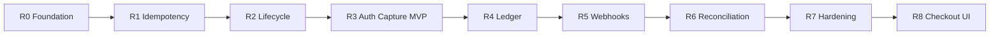
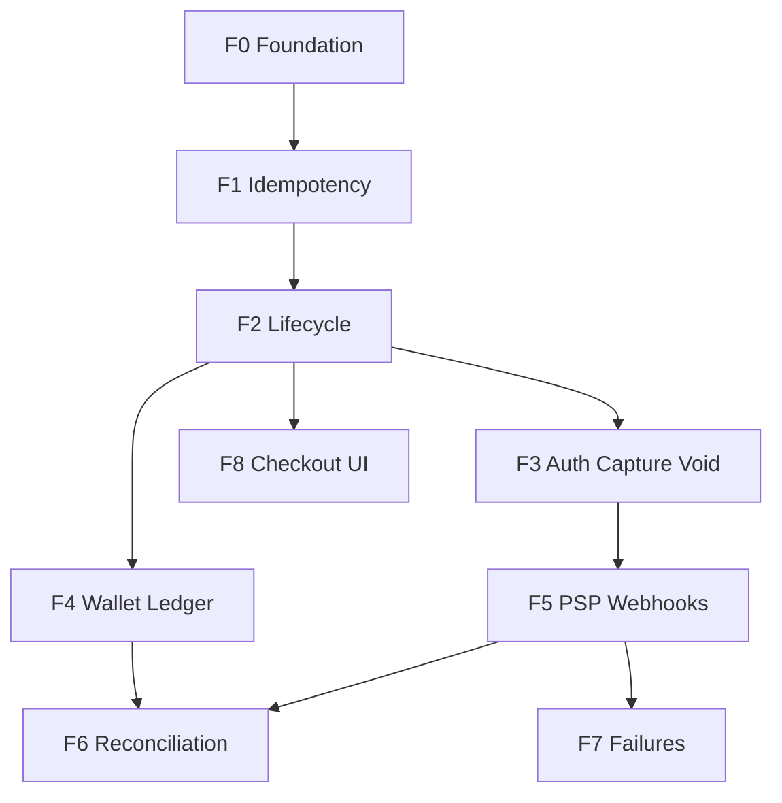

# Epic: PayFlow — Mini Payment Platform

> **Epic goal:** Build a learning-grade payment backend incrementally — each release adds one shippable capability without breaking prior behaviour.
>
> **Parent:** [PROJECT-FRAMING.md](../PROJECT-FRAMING.md)

---

## Epic summary

| Field | Value |
|---|---|
| **Epic** | PayFlow — mini payment platform for TPO + engineering learning |
| **Problem** | Payment systems fail on retries, async state, and ledger drift — hard to learn without building |
| **Outcome** | Runnable backend + portfolio artifacts; can explain pay-in flow and three failure questions |
| **MVP** | F0–F3 (foundation → idempotency → lifecycle → auth/capture/void) |
| **Full depth** | F0–F6 |
| **Optional** | F7–F8 |

---

## Feature specifications (detailed)

Each feature has full user stories, API contracts, data models, tests, and PO note templates.

| ID | Feature | Release | Spec |
|:---:|---|:---:|---|
| **F0** | Platform foundation | R0 | [f00-platform-foundation.md](./features/f00-platform-foundation.md) |
| **F1** | Idempotent payment creation | R1 | [f01-idempotent-payment-creation.md](./features/f01-idempotent-payment-creation.md) |
| **F2** | Payment lifecycle & status | R2 | [f02-payment-lifecycle.md](./features/f02-payment-lifecycle.md) |
| **F3** | Auth / capture / void | R3 (**MVP**) | [f03-auth-capture-void.md](./features/f03-auth-capture-void.md) |
| **F4** | Wallet & double-entry ledger | R4 | [f04-wallet-ledger.md](./features/f04-wallet-ledger.md) |
| **F5** | Simulated PSP & webhooks | R5 | [f05-psp-webhooks.md](./features/f05-psp-webhooks.md) |
| **F6** | Reconciliation | R6 | [f06-reconciliation.md](./features/f06-reconciliation.md) |
| **F7** | Failure handling *(optional)* | R7 | [f07-failure-handling.md](./features/f07-failure-handling.md) |
| **F8** | Checkout / miniapp demo *(optional)* | R8 | [f08-checkout-demo.md](./features/f08-checkout-demo.md) |

---

## Release train

| Release | Features | Demo in one sentence |
|:---:|---|---|
| **R0** | F0 | App starts, DB migrates, health check OK |
| **R1** | F1 | Create payment; retry same key → no duplicate |
| **R2** | F2 | Poll payment status; see transition history |
| **R3** | F3 | Authorize, capture, or void a payment |
| **R4** | F4 | Capture posts balanced ledger; wallet balance updates |
| **R5** | F5 | PSP webhook moves payment to terminal state |
| **R6** | F6 | Reconciliation report flags mismatches |
| **R7** | F7 | Stuck payment recovered or sent to DLQ |
| **R8** | F8 | Thin UI polls and shows user-facing status |

**Stop line for MVP:** R3  
**Stop line for full depth:** R6

---

## Dependency graph

**Parallel path:** After F2, build F3 or F4 in either order. F6 requires both F4 and F5.

---

## Database migration map

| Migration | Feature | Tables / changes |
|:---:|---|---|
| V1 | F0 | Baseline (empty) |
| V2 | F1 | `payments`, `idempotency_keys` |
| V3 | F2 | `payment_status_history` |
| V4 | F3 | `payments` authorize/capture timestamps, `psp_reference` |
| V5 | F4 | `accounts`, `ledger_entries` |
| V6 | F5 | `webhook_events` |
| V7 | F6 | `reconciliation_runs`, `reconciliation_exceptions` |
| V8 | F7 | `webhook_dlq` |

---

## Sprint backlog (~6–8 hrs/week)

| Sprint | Features | Release | Specs to implement |
|:---:|---|:---:|---|
| 1 | F0 + F1 | R1 | [F0](./features/f00-platform-foundation.md), [F1](./features/f01-idempotent-payment-creation.md) |
| 2 | F2 | R2 | [F2](./features/f02-payment-lifecycle.md) |
| 3 | F3 | R3 | [F3](./features/f03-auth-capture-void.md) |
| 4 | F4 | R4 | [F4](./features/f04-wallet-ledger.md) |
| 5 | F5 | R5 | [F5](./features/f05-psp-webhooks.md) |
| 6 | F6 | R6 | [F6](./features/f06-reconciliation.md) |
| 7 | F7 + F8 | R7–R8 | [F7](./features/f07-failure-handling.md), [F8](./features/f08-checkout-demo.md) |

---

## Cross-cutting enablers (all features)

| Enabler | From |
|---|---|
| Correlation ID logging | F0 |
| OpenAPI updated per feature | F1+ |
| Integration tests per feature | F1+ |
| 1-page PO note per feature | Each spec has template |
| Architecture diagram updates | After F2, F4, F5, F6 |

---

## Epic definition of done

### MVP (R3)

- [ ] F0–F3 specs implemented with tests
- [ ] Demo: create → authorize → capture (or void)
- [ ] Can answer double-tap Pay with working idempotency

### Full depth (R6)

- [ ] F0–F6 complete
- [ ] Ledger balances; webhooks idempotent; reconciliation report works

### Portfolio

- [ ] OpenAPI published
- [ ] 6+ PO notes filled in
- [ ] README setup + demo commands

---

## Reference chapter mapping

| Feature | Xu / Pragmatic Engineer |
|---|---|
| F1 | Idempotency, exactly-once |
| F2 | Payment order status, async |
| F3 | PSP integration, auth flow |
| F4 | Wallet, double-entry ledger |
| F5 | Webhooks, PSP deep dive |
| F6 | Reconciliation |
| F7 | Failed payments, retry/DLQ |

---

## Next action

Start **Sprint 1** with [F0 spec](./features/f00-platform-foundation.md), then [F1 spec](./features/f01-idempotent-payment-creation.md).
