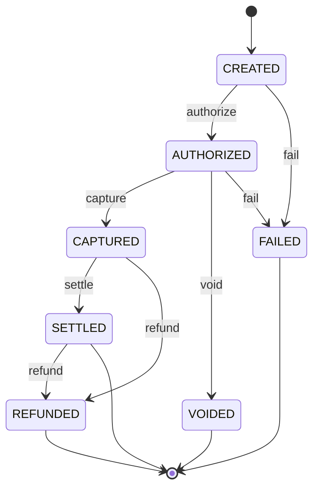

# F2 — Payment Lifecycle & Status

| Field | Value |
|---|---|
| **Feature ID** | F2 |
| **Release** | R2 |
| **Status** | Ready to build |
| **Depends on** | [F1](./f01-idempotent-payment-creation.md) |
| **Unlocks** | F3, F4, F8 |
| **Est. effort** | ~1 weekend |

---

## Goal

Payments are **async** — clients receive a payment ID immediately and **poll** for status. Every state change is recorded in an auditable history.

Maps to Xu chapter: payment order status, async processing delays.

---

## User stories

### F2-1 — State machine

**As the** payment system  
**I want** a strict lifecycle state machine  
**So that** invalid money states cannot occur

**Acceptance criteria**

- Valid states: `CREATED`, `AUTHORIZED`, `CAPTURED`, `SETTLED`, `FAILED`, `VOIDED`, `REFUNDED`
- Valid transitions enforced in domain layer (not ad-hoc string updates)
- Invalid transition → `422` with `currentStatus`, `requestedTransition`, error code `INVALID_STATE_TRANSITION`

### F2-2 — Get payment status

**As a** checkout client  
**I want to** fetch a payment by ID  
**So that** I can show the buyer current progress

**Acceptance criteria**

- `GET /api/v1/payments/{paymentId}` returns 200 with current status, amounts, timestamps
- Unknown ID → `404 Not Found`
- GET is idempotent (safe retry, no side effects)

### F2-3 — Transition history

**As** ops or support  
**I want** a full audit trail of status changes  
**So that** I can debug stuck checkouts

**Acceptance criteria**

- Response includes `history[]`: `{ "from", "to", "at", "reason" }` ordered oldest → newest
- Every successful transition appends one history row

### F2-4 — User-visible status mapping

**As a** product owner  
**I want** documented client copy per backend state  
**So that** miniapps/channels show consistent UX

**Acceptance criteria**

- Mapping table published in this doc (see below)
- OpenAPI describes enum values

### F2-5 — Internal transition API (dev/test)

**As a** developer  
**I want** a controlled way to advance state in tests before F3  
**So that** F2 can be validated without PSP

**Acceptance criteria**

- `POST /api/v1/internal/payments/{id}/transition` (profile=local/dev only) OR test-only service method
- Not exposed in production profile

---

## State machine



| From | Allowed to |
|---|---|
| `CREATED` | `AUTHORIZED`, `FAILED` |
| `AUTHORIZED` | `CAPTURED`, `VOIDED`, `FAILED` |
| `CAPTURED` | `SETTLED`, `REFUNDED` |
| `SETTLED` | `REFUNDED` |
| Terminal | No outbound transitions |

---

## User-visible status mapping

| Backend status | Recommended client message | Allow retry? |
|---|---|:---:|
| `CREATED` | Preparing your payment… | No |
| `AUTHORIZED` | Payment authorized — completing… | No |
| `CAPTURED` | Payment received — confirming… | No |
| `SETTLED` | Payment successful | No |
| `FAILED` | Payment failed. Please try again. | Yes (new idempotency key) |
| `VOIDED` | Payment cancelled | Yes (new checkout) |
| `REFUNDED` | Refund processed | No |

---

## Business rules

| Rule | Detail |
|---|---|
| BR-F2-1 | Status changes only via domain service — no direct SQL UPDATE from controllers |
| BR-F2-2 | `updated_at` on payment changes on every transition |
| BR-F2-3 | History is append-only |
| BR-F2-4 | Terminal states: `SETTLED`, `FAILED`, `VOIDED`, `REFUNDED` |

---

## API contract

### `GET /api/v1/payments/{paymentId}`

**Response `200 OK`**

```json
{
  "paymentId": "pay_7f3a2b1c",
  "status": "AUTHORIZED",
  "amountCents": 4999,
  "currency": "USD",
  "merchantId": "merchant-001",
  "customerId": "customer-001",
  "createdAt": "2026-06-09T10:00:00Z",
  "updatedAt": "2026-06-09T10:00:05Z",
  "history": [
    { "from": null, "to": "CREATED", "at": "2026-06-09T10:00:00Z", "reason": "payment.created" },
    { "from": "CREATED", "to": "AUTHORIZED", "at": "2026-06-09T10:00:05Z", "reason": "payment.authorized" }
  ]
}
```

---

## Data model (V3 migration)

### `payment_status_history`

| Column | Type | Notes |
|---|---|---|
| `id` | BIGSERIAL | PK |
| `payment_id` | VARCHAR(36) | FK → payments |
| `from_status` | VARCHAR(32) | Nullable for initial |
| `to_status` | VARCHAR(32) | NOT NULL |
| `reason` | VARCHAR(128) | e.g. `payment.authorized` |
| `created_at` | TIMESTAMPTZ | NOT NULL |

Index: `(payment_id, created_at)`

---

## Test scenarios

| # | Scenario | Expected |
|:---:|---|---|
| T2-1 | GET existing payment | 200 + history |
| T2-2 | GET unknown payment | 404 |
| T2-3 | CREATED → AUTHORIZED | Valid, history length +1 |
| T2-4 | CREATED → SETTLED | 422 invalid transition |
| T2-5 | FAILED → AUTHORIZED | 422 |
| T2-6 | Double GET | Identical responses |

---

## Demo script

```bash
# After F1 create returns paymentId
PAY_ID=pay_xxx
curl -s http://localhost:8080/api/v1/payments/$PAY_ID | jq .
# Poll loop (demo)
watch -n2 curl -s http://localhost:8080/api/v1/payments/$PAY_ID
```

---

## Definition of done

- [ ] State machine unit tests cover all valid + invalid transitions
- [ ] GET endpoint + history in integration tests
- [ ] User-visible mapping table reviewed
- [ ] PO note: async checkout UX

---

## Out of scope

- Public authorize/capture endpoints (F3)
- Ledger postings (F4)
- Webhooks (F5)

---

## PO note template

**Problem:** Buyers see a spinner while payment status resolves asynchronously.

**Decision:** Poll `GET /payments/{id}`; expose history for support; strict state machine.

**User impact:** Clear messaging per state; no "stuck unknown" without audit trail.

**Metrics:** Time-in-state p95, % payments reaching terminal state within SLA.
