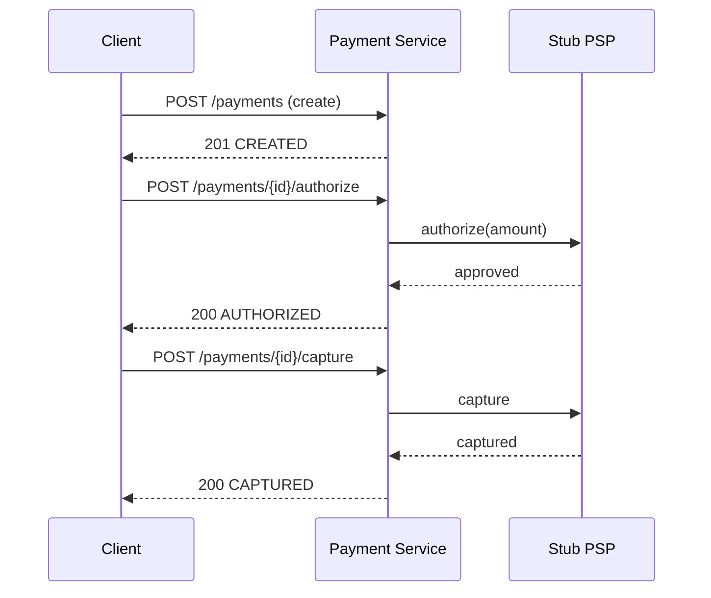

# F3 — Auth / Capture / Void (Two-Phase Flow)

| Field | Value |
|---|---|
| **Feature ID** | F3 |
| **Release** | R3 (**MVP**) |
| **Status** | Ready to build |
| **Depends on** | [F2](./f02-payment-lifecycle.md) |
| **Unlocks** | F5 |
| **Est. effort** | ~1 weekend |

---

## Goal

Model **card-like two-phase payment**: authorize (hold) → capture (finalize) or void (cancel). This is the MVP capstone — demo full happy path and cancel path without real PSP.

Maps to *Anatomy of the Swipe* auth/capture/settlement + Xu PSP integration intro.

---

## User stories

### F3-1 — Authorize payment

**As a** merchant checkout flow  
**I want to** authorize funds on a payment  
**So that** the amount is held before capture

**Acceptance criteria**

- `POST /api/v1/payments/{id}/authorize` when status is `CREATED`
- Then status → `AUTHORIZED`, history records `payment.authorized`
- Requires `Idempotency-Key`
- Retry with same key → same response, no double authorize

### F3-2 — Capture payment

**As a** merchant  
**I want to** capture a previously authorized payment  
**So that** funds are finalized for settlement

**Acceptance criteria**

- `POST /api/v1/payments/{id}/capture` when status is `AUTHORIZED`
- Then status → `CAPTURED`
- Optional body: `{ "amountCents": 4999 }` for partial capture (stretch — full capture if omitted)

### F3-3 — Void authorization

**As a** buyer or merchant  
**I want to** cancel an authorization before capture  
**So that** the hold is released

**Acceptance criteria**

- `POST /api/v1/payments/{id}/void` when status is `AUTHORIZED`
- Then status → `VOIDED`
- Void after capture → `422 INVALID_STATE_TRANSITION`

### F3-4 — Block invalid sequences

**As the** payment system  
**I want to** reject out-of-order operations  
**So that** money state stays consistent

**Acceptance criteria**

- Capture on `CREATED` → 422
- Void on `CAPTURED` → 422
- Authorize on `AUTHORIZED` → 422 (or idempotent replay only)

### F3-5 — Simulated processing delay (optional)

**As a** demo  
**I want** authorize to take ~2s  
**So that** polling UX is realistic before F5 webhooks

**Acceptance criteria**

- Config flag `payflow.psp.simulated-delay-ms=2000`
- During delay, optional interim status `PROCESSING` if desired (document choice)

---

## Business rules

| Rule | Detail |
|---|---|
| BR-F3-1 | Authorize, capture, void are **mutating** — all require idempotency keys |
| BR-F3-2 | Capture amount ≤ authorized amount |
| BR-F3-3 | One successful capture per payment (MVP — no multi-capture) |
| BR-F3-4 | F3 uses **in-memory stub PSP** — real adapter in F5 |

---

## API contract

### `POST /api/v1/payments/{paymentId}/authorize`

**Headers:** `Idempotency-Key` (required)

**Response `200 OK`**

```json
{
  "paymentId": "pay_7f3a2b1c",
  "status": "AUTHORIZED",
  "authorizedAt": "2026-06-09T10:01:00Z"
}
```

### `POST /api/v1/payments/{paymentId}/capture`

**Request (optional partial)**

```json
{ "amountCents": 4999 }
```

**Response `200 OK`**

```json
{
  "paymentId": "pay_7f3a2b1c",
  "status": "CAPTURED",
  "capturedAt": "2026-06-09T10:05:00Z"
}
```

### `POST /api/v1/payments/{paymentId}/void`

**Response `200 OK`**

```json
{
  "paymentId": "pay_7f3a2b1c",
  "status": "VOIDED",
  "voidedAt": "2026-06-09T10:02:00Z"
}
```

---

## Sequence — happy path



---

## Data model changes (V4)

### `payments` — add columns

| Column | Type | Notes |
|---|---|---|
| `authorized_at` | TIMESTAMPTZ | |
| `captured_at` | TIMESTAMPTZ | |
| `voided_at` | TIMESTAMPTZ | |
| `psp_reference` | VARCHAR(64) | Stub ref until F5 |

Reuse `idempotency_keys` for authorize/capture/void scoped by `(key, operation)`.

---

## Test scenarios

| # | Scenario | Expected |
|:---:|---|---|
| T3-1 | create → authorize → capture | End status CAPTURED |
| T3-2 | create → authorize → void | End status VOIDED |
| T3-3 | capture without authorize | 422 |
| T3-4 | void after capture | 422 |
| T3-5 | Idempotent authorize retry | Single AUTHORIZED |
| T3-6 | Partial capture > authorized | 422 |

---

## Demo script

```bash
KEY1=$(uuidgen); KEY2=$(uuidgen); KEY3=$(uuidgen)
BASE=http://localhost:8080/api/v1/payments

PID=$(curl -s -X POST $BASE -H "Content-Type: application/json" -H "Idempotency-Key: $KEY1" \
  -d '{"amountCents":4999,"currency":"USD","merchantId":"m1","customerId":"c1"}' | jq -r .paymentId)

curl -s -X POST $BASE/$PID/authorize -H "Idempotency-Key: $KEY2"
curl -s -X POST $BASE/$PID/capture  -H "Idempotency-Key: $KEY3"
curl -s $BASE/$PID | jq .
```

---

## Definition of done

- [ ] Happy path + void path demo scripts pass
- [ ] All F3 test scenarios automated
- [ ] MVP release **R3** tagged
- [ ] PO note: auth vs capture vs settlement

---

## Out of scope

- Real PSP HTTP calls (F5)
- Ledger money movement (F4 — can integrate after)
- Refunds (post-MVP stretch)

---

## PO note template

**Problem:** Card payments hold funds before final capture; cancel path must exist.

**Decision:** Explicit authorize/capture/void API aligned to state machine.

**User impact:** Merchant can cancel before shipment; buyer not charged until capture.

**Metrics:** Auth→capture conversion, void rate, time between authorize and capture.

**Validate with engineering:** Partial capture rules; idempotency per operation type.
