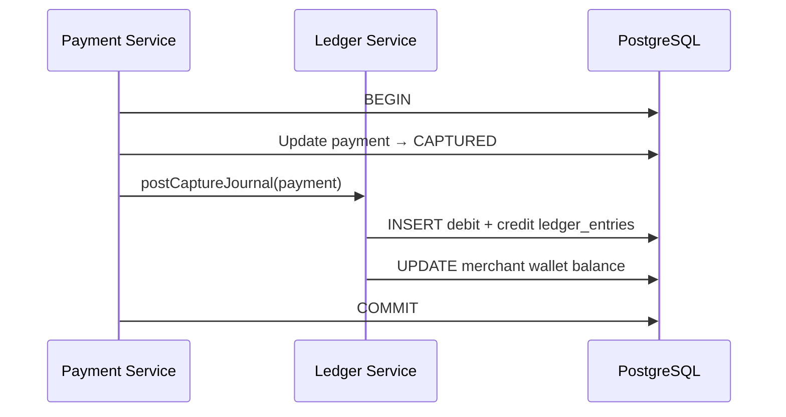

# F4 — Wallet & Double-Entry Ledger

| Field | Value |
|---|---|
| **Feature ID** | F4 |
| **Release** | R4 |
| **Status** | Ready to build |
| **Depends on** | [F2](./f02-payment-lifecycle.md) (F3 recommended) |
| **Unlocks** | F6 |
| **Est. effort** | ~1–2 weekends |

---

## Goal

Record **where money went** with an append-only **double-entry ledger**. Wallet balance is a derived/cached view; ledger is source of truth.

Maps to Xu chapter: wallet, ledger, double-entry bookkeeping.

---

## User stories

### F4-1 — Merchant wallet accounts

**As a** marketplace  
**I want** each merchant to have a wallet account  
**So that** seller balances are tracked after pay-in

**Acceptance criteria**

- Auto-create wallet on first payment to `merchantId` OR explicit `POST /api/v1/wallets`
- Wallet keyed by `(merchantId, currency)`

### F4-2 — System accounts

**As the** platform  
**I want** settlement and suspense accounts  
**So that** every journal balances to zero

**Acceptance criteria**

- Seed accounts: `PLATFORM_SETTLEMENT`, `PLATFORM_SUSPENSE` per currency
- Created via Flyway seed migration

### F4-3 — Post journal on capture

**As the** ledger service  
**I want to** write balanced entries when payment is captured  
**So that** books reflect money movement

**Acceptance criteria**

- On transition to `CAPTURED`, append journal:
  - **Debit** `PLATFORM_SUSPENSE` (or customer clearing) — amount
  - **Credit** merchant wallet — amount
- Same DB transaction as status update (or saga with outbox — keep simple: single TX for learning)

### F4-4 — Append-only ledger

**As** audit/compliance  
**I want** immutable entries  
**So that** history cannot be silently altered

**Acceptance criteria**

- No UPDATE/DELETE on `ledger_entries` in application code
- Corrections via reversing entries (future stretch)

### F4-5 — Balance query

**As a** merchant  
**I want to** see my wallet balance  
**So that** I know available funds

**Acceptance criteria**

- `GET /api/v1/wallets/{merchantId}?currency=USD` returns `{ "balanceCents", "currency", "asOf" }`
- Balance = sum(credits) − sum(debits) for account OR cached with reconciliation to ledger

### F4-6 — Insufficient funds (transfers)

**As the** system  
**I want to** reject debits that exceed balance  
**So that** accounts cannot go negative (MVP rule)

**Acceptance criteria**

- `POST /api/v1/transfers` (optional P2P demo) fails atomically if debit would exceed balance
- Uses `SELECT FOR UPDATE` on wallet/ account row

---

## Business rules

| Rule | Detail |
|---|---|
| BR-F4-1 | Every journal has ≥2 lines; sum(debits) = sum(credits) |
| BR-F4-2 | Amounts in minor units (BIGINT) |
| BR-F4-3 | One `journal_id` groups entries from one business event |
| BR-F4-4 | Wallet balance updated in same transaction as ledger insert |
| BR-F4-5 | No floating point anywhere |

---

## API contract

### `GET /api/v1/wallets/{merchantId}`

**Query:** `currency=USD`

**Response `200 OK`**

```json
{
  "merchantId": "merchant-001",
  "currency": "USD",
  "balanceCents": 4999,
  "asOf": "2026-06-09T10:05:01Z"
}
```

### `GET /api/v1/wallets/{merchantId}/ledger` (optional)

Paginated ledger entries for merchant account.

---

## Data model (V5 migration)

### `accounts`

| Column | Type | Notes |
|---|---|---|
| `id` | VARCHAR(36) | PK |
| `owner_type` | VARCHAR(16) | `MERCHANT`, `PLATFORM` |
| `owner_id` | VARCHAR(64) | merchantId or platform constant |
| `currency` | CHAR(3) | |
| `balance_cents` | BIGINT | Cached; reconciled to ledger |

Unique: `(owner_type, owner_id, currency)`

### `ledger_entries`

| Column | Type | Notes |
|---|---|---|
| `id` | BIGSERIAL | PK |
| `journal_id` | VARCHAR(36) | Groups related lines |
| `account_id` | VARCHAR(36) | FK |
| `payment_id` | VARCHAR(36) | Nullable FK |
| `entry_type` | VARCHAR(8) | `DEBIT` or `CREDIT` |
| `amount_cents` | BIGINT | Always positive |
| `created_at` | TIMESTAMPTZ | |

Constraint: per journal, SUM(debit amounts) = SUM(credit amounts) — enforced in app layer.

---

## Sequence — capture posts ledger



---

## Test scenarios

| # | Scenario | Expected |
|:---:|---|---|
| T4-1 | Capture $49.99 | 2 ledger lines, balanced journal |
| T4-2 | Wallet balance += 4999 | GET wallet matches |
| T4-3 | Manual sum of entries = balance | Reconciliation equality |
| T4-4 | Concurrent captures same merchant | No lost updates (locking) |
| T4-5 | Transfer exceeding balance | 422 INSUFFICIENT_FUNDS |

---

## Definition of done

- [ ] Capture triggers balanced journal
- [ ] Wallet balance query correct
- [ ] Ledger immutability enforced in tests
- [ ] PO note: ledger vs wallet

---

## Out of scope

- Multi-currency FX
- Pay-out to bank (Xu pay-out flow — stretch epic)
- Real-time balance cache invalidation across services

---

## PO note template

**Problem:** Payment status alone doesn't prove where money sits on platform books.

**Decision:** Double-entry ledger on capture; merchant wallet as operational balance.

**User impact:** Merchant sees earnings; finance can audit journal.

**Metrics:** Ledger imbalance count (must be 0), wallet vs ledger drift.

**Validate with finance/ops:** Chart of accounts mapping; reversal policy.
