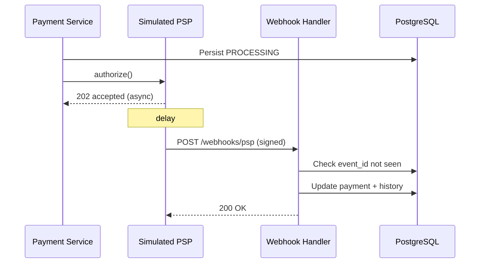

# F5 — Simulated PSP & Webhooks

| Field | Value |
|---|---|
| **Feature ID** | F5 |
| **Release** | R5 |
| **Status** | Ready to build |
| **Depends on** | [F3](./f03-auth-capture-void.md) |
| **Unlocks** | F6, F7 |
| **Est. effort** | ~1 weekend |

---

## Goal

Replace the in-process stub with a **PSP adapter + simulator** and handle **async webhooks** — the pattern Stripe/PayPal use to confirm payments after the API returns.

Answers: **"What if the PSP confirms but our DB write fails?"** — write-before-call + idempotent webhooks.

---

## User stories

### F5-1 — PSP adapter interface

**As an** engineer  
**I want** a pluggable `PspClient`  
**So that** simulator and future real PSP share the same contract

**Acceptance criteria**

- Interface methods: `authorize`, `capture`, `void`, `refund` (refund stub OK)
- Implementations: `SimulatedPspClient`, (future) `StripePspClient`

### F5-2 — Simulated PSP behaviour

**As a** developer  
**I want** configurable PSP outcomes  
**So that** I can test success, failure, and delay

**Acceptance criteria**

- Config: `payflow.psp.mode=success|failure|timeout`
- Config: `payflow.psp.webhook-delay-ms`
- Simulator generates `pspReference` and async webhook event

### F5-3 — Write before external call

**As the** payment system  
**I want** payment persisted as `PROCESSING` before calling PSP  
**So that** a crash after PSP success still leaves a recoverable record

**Acceptance criteria**

- Authorize flow: UPDATE status → `PROCESSING` (or keep `CREATED` + flag) → call PSP → await webhook or sync response
- Document chosen pattern in ADR

### F5-4 — Webhook ingestion

**As the** PSP  
**I want to** POST events to PayFlow  
**So that** terminal status reaches the merchant system

**Acceptance criteria**

- `POST /api/v1/webhooks/psp`
- Headers: `X-Psp-Signature`, `X-Psp-Event-Id`
- Body includes `eventType`, `paymentId`, `pspReference`, `status`

### F5-5 — Webhook signature verification

**As the** payment system  
**I want** HMAC verification  
**So that** forged webhooks are rejected

**Acceptance criteria**

- Invalid signature → `401 Unauthorized`
- Valid signature → process event

### F5-6 — Webhook idempotency

**As the** payment system  
**I want** duplicate events ignored  
**So that** at-least-once delivery is safe

**Acceptance criteria**

- Store processed `event_id` in `webhook_events` table
- Duplicate `event_id` → `200 OK` with no state change (replay safe)

### F5-7 — Event → state mapping

**As a** checkout client  
**I want** payment to reach terminal state after webhook  
**So that** polling eventually shows success or failure

**Acceptance criteria**

- `payment.authorized` → `AUTHORIZED`
- `payment.captured` → `CAPTURED`
- `payment.failed` → `FAILED`
- History + payment row updated atomically

---

## Business rules

| Rule | Detail |
|---|---|
| BR-F5-1 | Never store PAN/CVV — simulator uses token references only |
| BR-F5-2 | Webhook handler must be fast — heavy work async (optional queue) |
| BR-F5-3 | Raw webhook payload stored for audit |
| BR-F5-4 | Clock skew tolerance ±5 min on signature timestamp (if used) |

---

## API contract

### `POST /api/v1/webhooks/psp`

**Headers**

| Header | Description |
|---|---|
| `X-Psp-Event-Id` | Unique event ID |
| `X-Psp-Signature` | `sha256=...` HMAC of raw body |

**Request example**

```json
{
  "eventType": "payment.captured",
  "eventId": "evt_abc123",
  "paymentId": "pay_7f3a2b1c",
  "pspReference": "psp_xyz789",
  "amountCents": 4999,
  "currency": "USD",
  "occurredAt": "2026-06-09T10:05:30Z"
}
```

**Response:** `200 OK` `{ "received": true }`

---

## Data model (V6 migration)

### `webhook_events`

| Column | Type | Notes |
|---|---|---|
| `event_id` | VARCHAR(128) | PK |
| `payment_id` | VARCHAR(36) | |
| `event_type` | VARCHAR(64) | |
| `payload` | JSONB | Raw body |
| `processed_at` | TIMESTAMPTZ | |
| `status` | VARCHAR(16) | `PROCESSED`, `FAILED` |

### `payments` — extend

| Column | Notes |
|---|---|
| `psp_reference` | From PSP |
| `last_webhook_at` | |

---

## Sequence



---

## Test scenarios

| # | Scenario | Expected |
|:---:|---|---|
| T5-1 | Happy webhook after authorize | AUTHORIZED |
| T5-2 | Duplicate same event_id | 200, no double transition |
| T5-3 | Bad signature | 401 |
| T5-4 | Webhook for unknown payment | 404 or dead-letter log |
| T5-5 | Out-of-order events | Document + test expected behaviour |

---

## Demo script

```bash
# Trigger authorize (starts async PSP)
curl -s -X POST $BASE/$PID/authorize -H "Idempotency-Key: $(uuidgen)"

# Simulator fires webhook automatically — then poll
sleep 3
curl -s $BASE/$PID | jq .status

# Manual webhook inject (dev)
curl -s -X POST http://localhost:8080/api/v1/webhooks/psp \
  -H "Content-Type: application/json" \
  -H "X-Psp-Event-Id: evt_test_1" \
  -H "X-Psp-Signature: sha256=..." \
  -d '{"eventType":"payment.captured","eventId":"evt_test_1","paymentId":"'"$PID"'"}'
```

---

## Definition of done

- [ ] End-to-end async authorize → webhook → terminal state
- [ ] Idempotent webhook tests pass
- [ ] PO note: at-least-once delivery

---

## Out of scope

- Real Stripe API keys
- Outbox pattern / Kafka (optional in F7)
- Pay-out webhooks

---

## PO note template

**Problem:** PSP confirmation arrives asynchronously; delivery may duplicate or fail.

**Decision:** Signed webhooks + idempotent event store; persist before external call.

**User impact:** Reliable final status; polling resolves after webhook.

**Metrics:** Webhook processing latency, duplicate event rate, signature failure rate.
